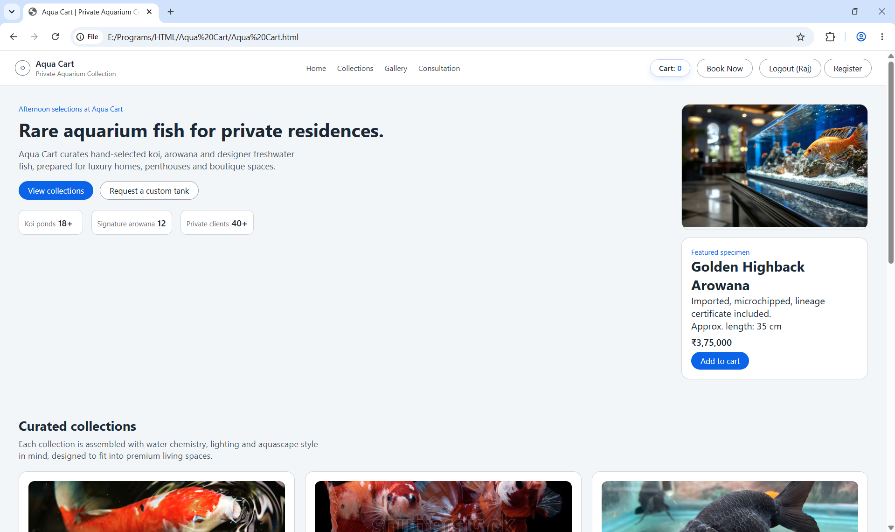
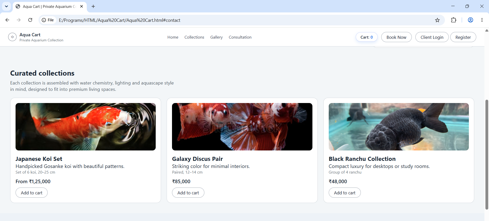
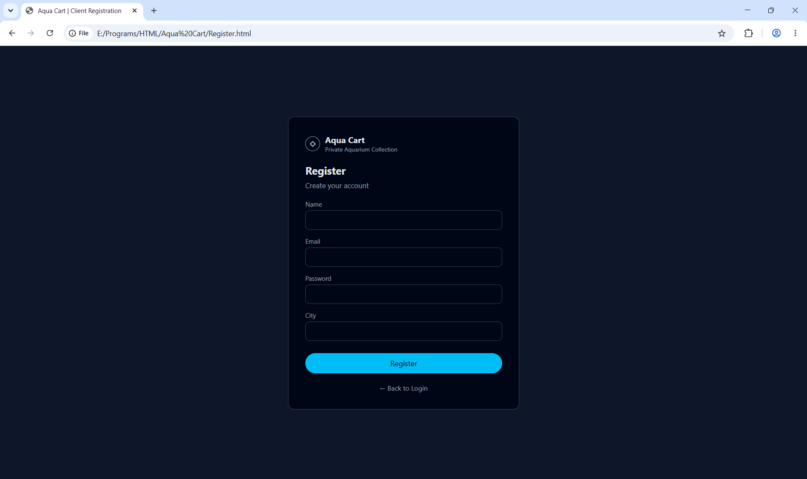
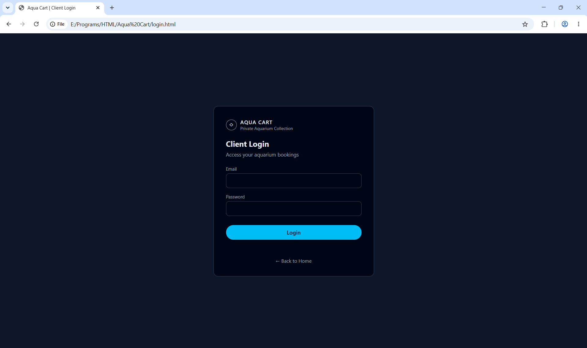
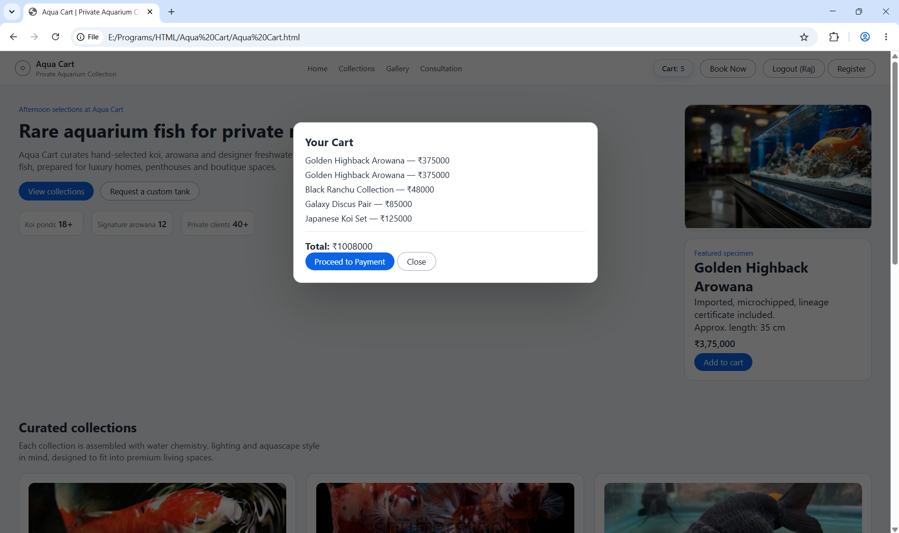
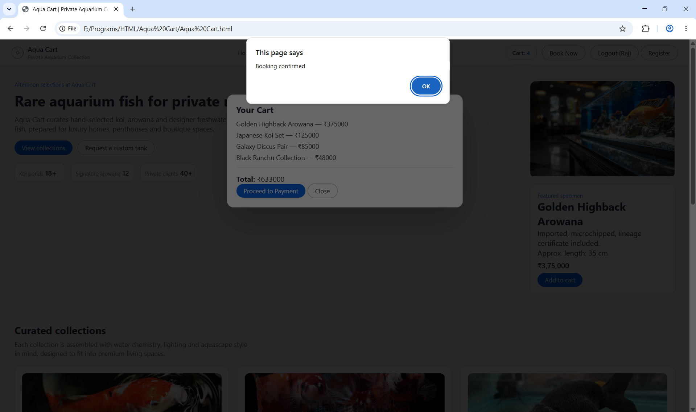

# 🌊 Aqua Cart

Aqua Cart is a full-stack e-commerce application for showcasing and selling premium aquarium fish (e.g., Arowana, Koi, Ranchu).

This repository currently contains:

- a legacy Vanilla JS frontend (`.html/.css/.js`)
- a modern React (Vite) frontend under `Aqua Cart React/`
- a Node.js + Express backend API
- a MySQL database schema/seed script

This project is currently in a migration phase from Vanilla JS UI to React.

---

## 📸 Preview

## 🏠 Home Experience


## 🐟 Curated Collections


## 🔐 Authentication

### Register Page


### Login Page


## 🛒 Cart & Payment Flow

### 1) Cart Modal with Selected Items


### 2) Redirecting to Payment Gateway


### 3) Payment Successful


### 4) Booking Confirmed


---

## ✨ Features

### Customer Experience
- Responsive storefront UI for desktop/mobile
- Product browsing for premium aquarium fish
- Add/remove cart items
- Running cart total and checkout-ready flow

### Authentication
- User registration
- User login
- Session/auth state handling in frontend/backend flow

### Backend/API
- Express API for auth and cart operations
- Modular backend setup for future feature expansion
- CORS-enabled client/server communication

### Data Layer
- MySQL-backed persistence
- SQL schema and seed data included (`aquacart_db.sql`)

### Frontend Architecture
- Legacy Vanilla frontend retained for stability
- New React + Vite frontend under active migration

---

## 🛠️ Tech Stack

Frontend (Legacy):
- HTML5
- CSS3
- Vanilla JavaScript (DOM + Fetch API)

Frontend (Modern):
- React
- Vite

Backend:
- Node.js
- Express
- CORS
- mysql2

Database:
- MySQL

---

## 📂 Project Structure

```text
Aqua-Cart/
├── Aqua Cart React/
│   ├── public/
│   ├── src/
│   ├── index.html
│   ├── package.json
│   └── vite.config.js
├── backend/
│   ├── db.js
│   ├── server.js
│   └── package.json
├── docs/
├── Aqua Cart.html
├── Aqua Cart.css
├── Aqua Cart.js
├── Login.html
├── Register.html
├── aquacart_db.sql
└── .gitignore
```

---

## ✅ Prerequisites

Make sure the following are installed:

- Node.js 18+ (recommended)
- npm 9+ (or compatible)
- MySQL 8+ (or compatible)

---

## ⚙️ Environment Configuration

Create a `.env` file in `backend/` (or update `db.js` if using hardcoded config).

```env
PORT=5000
DB_HOST=localhost
DB_USER=root
DB_PASSWORD=your_password
DB_NAME=aquacart_db
DB_PORT=3306
```

---

## 🗄️ Database Setup

1. Start your MySQL server.
2. Create/import the database using `aquacart_db.sql`.

```bash
mysql -u root -p < aquacart_db.sql
```

---

## 🚀 Getting Started

### 1) Clone the repository

```bash
git clone https://github.com/RajKamalPathak/Aqua-Cart.git
cd Aqua-Cart
```

### 2) Run backend API

```bash
cd backend
npm install
npm start
```

Backend expected at: `http://localhost:5000` (or your configured `PORT`).

### 3) Run React frontend

```bash
cd "../Aqua Cart React"
npm install
npm run dev
```

Frontend expected at: `http://localhost:5173`.

### 4) Run legacy frontend (optional)

Open `Aqua Cart.html` directly in browser or serve statically with any local server.

---

## 🔌 API Overview

Example route groups:
- `POST /api/register`
- `POST /api/login`
- `GET /api/cart/:userId`
- `POST /api/cart`
- `PUT /api/cart/:itemId`
- `DELETE /api/cart/:itemId`

---

## 🔐 Security Notes

For real-world deployment:

- Do not commit secrets or DB credentials.
- Use `.env` and secret managers.
- Hash passwords before storing.
- Validate and sanitize all user input.
- Restrict CORS to trusted origins.
- Use HTTPS in production.

---

## 📦 Deployment

You can deploy components independently:

- Frontend (React): Vercel / Netlify
- Backend (Express): Render / Railway / Fly.io / VPS
- Database (MySQL): PlanetScale / Railway / managed MySQL

---

## 🗺️ Roadmap

- [ ] Complete migration from Vanilla frontend to React
- [ ] Introduce product inventory management dashboard
- [ ] Add checkout/payment integration
- [ ] Add order history and tracking
- [ ] Add automated tests and CI pipeline
- [ ] Add role-based access (admin/customer)

---

## 🤝 Contributing

Contributions are welcome.

1. Fork the repo
2. Create a feature branch (`feature/your-feature`)
3. Commit changes
4. Open a Pull Request

---

## 👤 Author

Raj Kamal Pathak  
GitHub: [@RajKamalPathak](https://github.com/RajKamalPathak)
